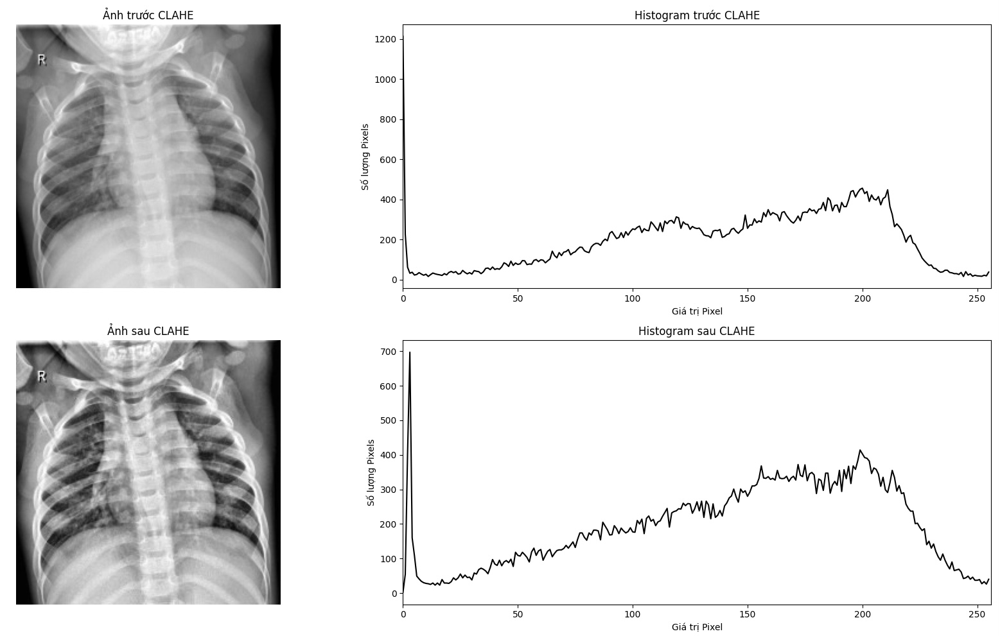
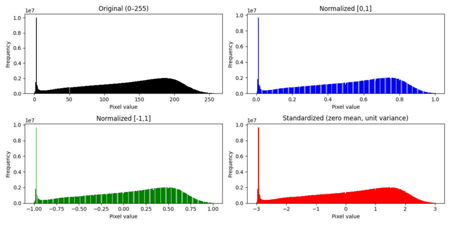
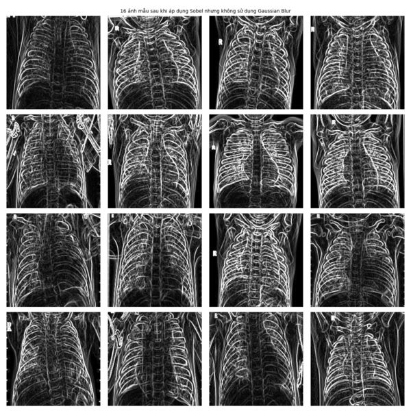
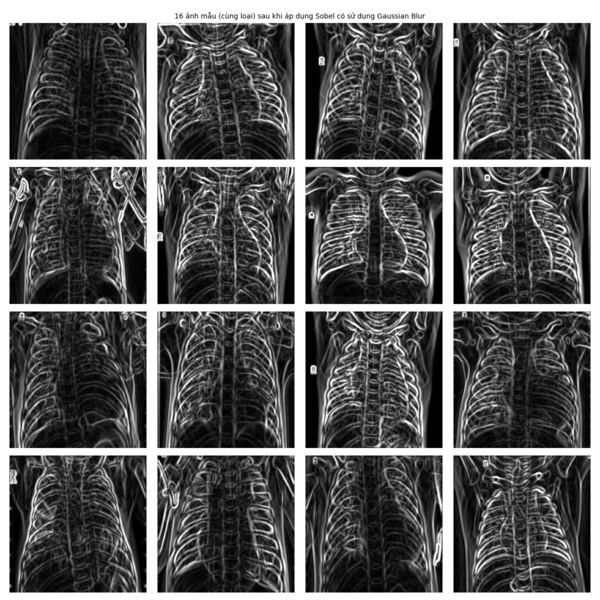

# Dự án Tiền xử lý và Phân tích Dữ liệu

Dự án này tập trung vào việc khám phá, tiền xử lý và chuẩn bị loại dữ liệu ảnh.


## Mô tả tập dữ liệu

### Dữ liệu ảnh X-quang Ngực (Viêm phổi)

* **Tên:** [Chest X-Ray Images (Pneumonia)](https://www.kaggle.com/datasets/paultimothymooney/chest-xray-pneumonia)
* **Tổng quan:** Tập dữ liệu chứa **5,863 ảnh X-quang ngực** (JPEG) được thu thập từ bệnh nhi (1-5 tuổi) tại *Guangzhou Women and Children’s Medical Center, China*.
* **Phân loại:** Dữ liệu được chia thành hai lớp để phân loại nhị phân:
    * `PNEUMONIA` (Viêm phổi): 4,273 ảnh
    * `NORMAL` (Bình thường): 1,584 ảnh
* **Cấu trúc:** Dữ liệu được chia sẵn thành 3 tập: `train/`, `test/`, và `val/`.
* **Lý do lựa chọn:** Đây là dữ liệu y khoa trực quan nhưng chứa nhiều nhiễu (độ sáng không đồng đều, tương phản thấp). Dự án này khám phá các kỹ thuật tiền xử lý (chuẩn hoá, CLAHE, phát hiện biên) để cải thiện độ rõ nét và làm nổi bật các cấu trúc phổi.


## Kho Tư Duy & Quyết Định Kỹ Thuật (Key Technical Decisions)

Dự án này không dừng lại ở việc áp dụng công cụ một cách thụ động, mà tiếp cận theo góc nhìn phân tích thực nghiệm từ Toán học tới đặc thù của Y khoa (Medical Domain).

### 1. Phân Tích Kênh Màu (Color Channel Analysis)
Bằng cách thống kê trên toàn bộ 5,863 bức ảnh, kết quả thực nghiệm chỉ ra 100% pixel có kênh màu $R=G=B$. Mặc dù định dạng ảnh đầu vào là RGB (3 kênh), nhưng thông tin chứa đựng đã là đơn sắc (Grayscale).
*   **Quyết định Tiền Xử Lý:** Chuyển đổi toàn bộ ma trận ảnh sang không gian 1-chiều (Grayscale) bằng Tỉ số Nhạy Sáng Luma của mắt người. Quyết định này giúp **giảm trọng tải không gian bộ nhớ tới 3 lần**, đồng thời tối ưu hóa cực điểm độ phức tạp của Tích chập (Convolution) trong các mạng Deep Learning sau này.

### 2. Tương Phản Thích Ứng Cục Bộ (CLAHE vs Global HE)
Đặc thù của chụp X-quang là phần nền đen (background) chiếm tỷ lệ vô cùng lớn, trong khi các dải tương phản vùng tổn thương phổi lại rất yếu.
*   **Lý do từ chối HE Toàn Cục (Global Histogram Equalization):** Thuật toán HE phân mảnh CDF trên toàn bộ không gian ảnh, vô tình làm khuếch đại cực đại nhiễu ở những mảng nền đen đồng nhất, tạo ra các vệt giả (artifacts).
*   **Lý do chọn CLAHE (Contrast Limited Adaptive Histogram Equalization):** Tính CDF dựa trên các vùng lân cận cục bộ (tile-based) và tái phân phối các điểm giới hạn ngưỡng (*Clipping Limit Redistribution*). Phương pháp này giúp làm nét cực độ cấu trúc xương sườn nội cục mà vẫn khóa cứng được tính toàn vẹn của nền đen y tế.

<p align="center">
  
  <br>
  <em>Histogram sau khi áp dụng CLAHE: Trải dài dải sắc độ cục bộ theo khu vực mà không "băm nát" cấu trúc nền viền.</em>
</p>

### 3. Giải Cứu Độ Lệch Phân Phối (Z-Score vs Min-Max Normalization)
Khi vẽ biểu đồ phân phối điểm ảnh toàn tập dữ liệu, phân phối của X-Ray bị lệch cực độ (Skewed), với một đỉnh (peak) tĩnh khổng lồ nằm ngay mốc 0 do toàn bộ khoảng nền tối của phim chụp.

*   **Quyết định Kỹ Thuật:** Việc nén khoảng không theo `Min-Max Scaling [0, 1]` chỉ thay đổi tỷ lệ thước đo, đồ thị lệch vẫn lệch. Ngược lại, nhờ áp dụng **Chuẩn hoá Z-score (Standardization)**, toàn bộ tâm trung bình (mean) được dịch chuyển tuyệt đối về 0. Nền đen bị tịnh tiến sang khoảng âm, tạo điểm tựa trung bình ($0$) cho miền bệnh lý, qua đó giúp sự lan truyền ngược (back-propagation) của mô hình phân loại không bị thiên vị hay bão phình Gradient tại giai đoạn khởi tạo.

<p align="center">
  
  <br>
  <em>(Trái) Dải [0,255]; (Giữa) Min-Max Scaling [0,1] giữ nguyên độ lệch; (Phải) Standard Z-Score di dời tâm Mean về gốc 0, giảm định kiến dữ liệu.</em>
</p>

### 4. Edge Detection & Trade-Off Khử Nhiễu (Gaussian Blur)
Một phát hiện mang tính y khoa: Các toán tử trích xuất cạnh (Edge Detection) như Sobel vô cùng nhạy cảm trước mọi xung động vi tính (nhiễu điểm/noise).

*   **Sự Đánh Đổi Tối Quan Trọng (The Trade-Off):** Việc tích hợp lớp lọc *Gaussian Blur* làm bộ tiền xử lý sẽ làm sạch các hạt nhiễu, làm nổi bật sơ đồ khung xương sườn. **Tuy nhiên**, đối với phân tích X-quang, "nhiễu" đôi khi lại là tín hiệu lâm sàng độc nhất đối với các điểm viêm phổi hay dập mờ. Quyết định áp dụng bộ lọc Gaussian hay thiết lập ngưỡng Canny $(150, 300)$ đòi hỏi kỹ sư phải **đánh đổi** giữa việc khai thác đặc trưng thô (Global Shapes - cần khử nhiễu) hay bảo tồn vân mô (Textural Frequencies - cấm khử nhiễu).

<p align="center">
   
  
  <br>
  <em>Cấu trúc màng phổi giữa KHÔNG dùng Gaussian Blur (trái) và CÓ dùng Gaussian Blur (phải) - Tôn vinh khả năng cân nhắc Trade-Offs.</em>
</p>

## Hướng dẫn chạy Notebooks

### 1. Yêu cầu về môi trường

Dự án này yêu cầu Python 3.x và các thư viện được liệt kê trong file `requirements.txt`.

**Bước 1: (Tùy chọn) Tạo và kích hoạt môi trường ảo**
```bash
# Tạo môi trường ảo
python -m venv venv

# Kích hoạt môi trường (Windows)
.\venv\Scripts\activate

# Kích hoạt môi trường (macOS/Linux)
source venv/bin/activate
```
**Bước 2: Cài đặt các thư viện cần thiết**
```bash
pip install -r requirements.txt
```

### Hướng dẫn chạy chi tiết

1. Khởi động Jupyter Lab hoặc Jupyter Notebook từ thư mục gốc của dự án:
   ```bash
   jupyter lab
   ```

#### Xử lý ảnh (Image Processing)

1. Tải dataset theo nguồn ở dưới, giải nén và để vào thư mục `data/images`. Sẽ có dạng `data/images/chest_xray`
2. Mở thư mục `notebooks`.
2. Chọn kernel chạy cho đúng đường dẫn python của môi trường ảo (venv) đã tạo ở bước trên.
3. Chạy file `.ipynb`.

## Tài nguyên bên ngoài

**Dataset Ảnh:**
  * Kaggle: https://drive.google.com/drive/folders/1RpmFLvLxbpw5nr5aKZQiBjWLCr8DyAIh?usp=drive_link
  * Nguồn gốc: https://data.mendeley.com/datasets/rscbjbr9sj/2

